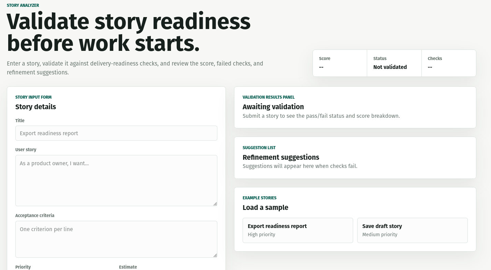
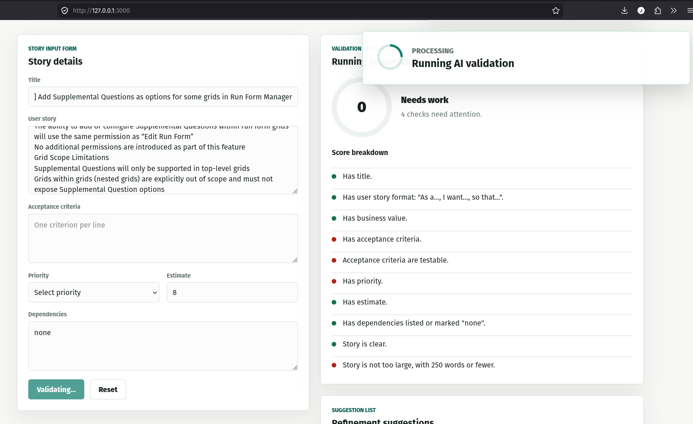
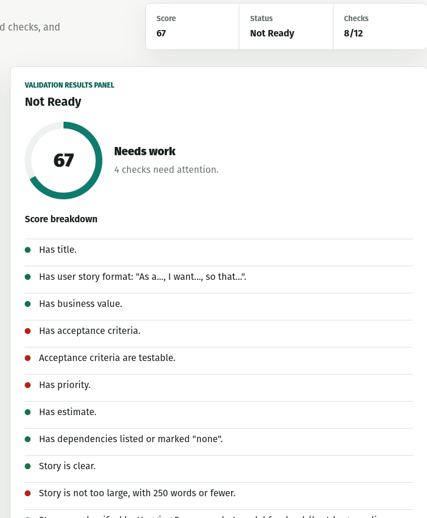
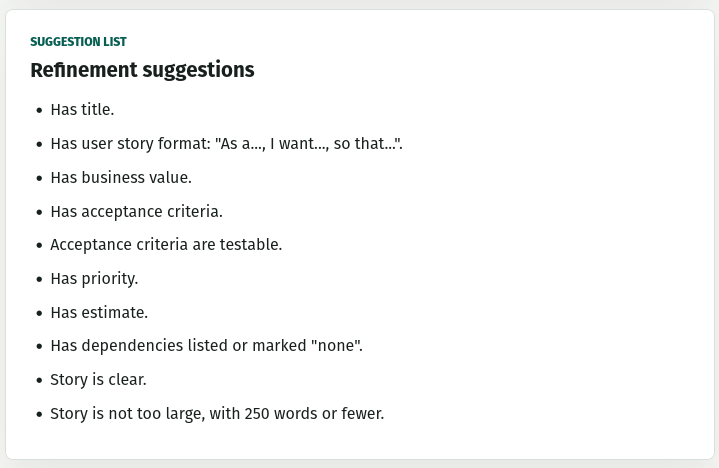

# Story Analyzer

Story Analyzer is a local web app for checking Azure DevOps-style user stories before work starts. It validates a story against rule-based readiness checks, runs Hugging Face zero-shot classification, and streams partial results back to the UI as validation work completes. The UI includes a floating progress indicator so it is clear when AI validation is still running.

## Images

These screenshots give a quick preview of the current PoC UI and validation flow.









## Prerequisites

Before setting up the project, confirm that Git, Python, Node.js, npm, and uv are available.

### 1. Check Git

```bash
git --version
```

If this fails, install Git from https://git-scm.com/downloads.

### 2. Check Python

This project requires Python 3.10 or newer.

```bash
python --version
```

If that command fails, try:

```bash
python3 --version
```

If Python is missing or older than 3.10, install the latest Python 3 release from https://www.python.org/downloads/.

### 3. Check Node.js and npm

The UI uses Next.js, which is installed through npm. You do not need to install Next.js globally.

```bash
node --version
npm --version
```

If either command fails, install the current LTS version of Node.js from https://nodejs.org/.

### 4. Check uv

The backend dependencies are managed with uv.

```bash
uv --version
```

If uv is missing, install it:

```bash
python -m pip install uv
```

If your system uses `python3` instead of `python`, run:

```bash
python3 -m pip install uv
```

## Setup

Clone the repository and enter the project directory:

```bash
git clone <repo-url>
cd story_analyzer
```

Install the backend dependencies:

```bash
uv sync
```

Install the frontend dependencies:

```bash
cd frontend
npm install
cd ..
```

## Run the App

On macOS, Linux, WSL, or Git Bash, run:

```bash
./start.sh
```

The script starts:

- FastAPI API: `http://127.0.0.1:8000`
- Next.js UI: `http://127.0.0.1:3000`

It waits for the UI to become available and then opens the default browser. Press `Ctrl+C` in the terminal to stop both servers.

## Manual Run Commands

If you are on Windows without Bash, or if you prefer separate terminals, start the backend and frontend manually.

Terminal 1:

```bash
uv run uvicorn main:app --host 127.0.0.1 --port 8000 --reload
```

Terminal 2:

```bash
cd frontend
npm run dev -- --hostname 127.0.0.1 --port 3000
```

Then open:

```text
http://127.0.0.1:3000
```

## First Run Notes

The first story validation that reaches Hugging Face classification may take longer because Transformers downloads the configured zero-shot model:

```text
facebook/bart-large-mnli
```

The default model can be changed with:

```bash
HUGGINGFACE_ZERO_SHOT_MODEL=<model-name> ./start.sh
```

For manual backend startup:

```bash
HUGGINGFACE_ZERO_SHOT_MODEL=<model-name> uv run uvicorn main:app --host 127.0.0.1 --port 8000 --reload
```

## Verify the Backend

Once the API is running:

```bash
curl http://127.0.0.1:8000/health
```

Expected response:

```json
{"status":"ok"}
```

Check Hugging Face backend availability:

```bash
curl http://127.0.0.1:8000/huggingface/status
```

The response should show `"available": true` and include at least one backend, such as `torch`.

## API Endpoints

- `GET /health` - basic API health check
- `GET /huggingface/status` - confirms Hugging Face model settings and available ML backend
- `POST /validate-story` - validates a story and returns one complete response
- `POST /validate-story/stream` - validates a story and streams rule, AI, and final score updates as newline-delimited JSON

## Troubleshooting

If `uv sync` fails because Python is too old, install Python 3.10 or newer and rerun `uv sync`.

If `npm install` fails, confirm `node --version` and `npm --version` work from the same terminal.

If port `8000` or `3000` is already in use, stop the existing process or run with different ports:

```bash
API_PORT=8010 UI_PORT=3010 ./start.sh
```

If the UI cannot reach the API, confirm the backend is running at `http://127.0.0.1:8000` and that `NEXT_PUBLIC_API_BASE_URL` points to the same URL when starting the frontend manually.

## Project Structure

```text
.
├── main.py                  # FastAPI app and validation endpoints
├── models.py                # Request and response models
├── validators/              # Rule and Hugging Face validators
├── scoring/                 # Readiness score calculation
├── frontend/                # Next.js UI
├── start.sh                 # Starts backend, frontend, and browser
├── pyproject.toml           # Python dependency metadata
└── uv.lock                  # Locked Python dependency versions
```

## Future Considerations

- Pull story details directly from Azure DevOps. Instead of relying only on copied form values, the backend could accept an organization, project, and work item ID, then call the Azure DevOps Work Items API to retrieve the title, description, acceptance criteria, priority, estimate, tags, links, and dependencies. Authentication would likely use a PAT for local use or an OAuth/service connection approach for team-hosted deployments.

- Normalize Azure DevOps fields. ADO teams often store acceptance criteria, dependencies, and estimates in different custom fields or HTML-rich descriptions. A production version should include a mapping layer so each team can configure which ADO fields feed the analyzer.

- Push analysis results back into Azure DevOps. The app could write a readiness summary as a work item comment, add tags such as `ReadyForWork` or `NeedsRefinement`, or update a custom readiness score field.

- Add Azure DevOps pipeline checks. A pipeline task could call the backend before allowing work to progress, fail the build/release when a linked story is below the readiness threshold, or publish the readiness report as a pipeline artifact. For PR workflows, the same check could inspect linked work items and post a status comment.

- Package the analyzer as a reusable CLI. A command such as `story-analyzer validate --work-item 12345` would make it easier to run from Azure DevOps YAML pipelines, local scripts, or scheduled quality checks.

- Make rules configurable. The current rules are hardcoded for the PoC. A future version should support configurable rule sets, severity levels, scoring weights, and team-specific readiness definitions.

- Improve async job handling. The current streaming behavior is intentionally lightweight for the PoC. A production version should consider durable jobs, cancellation endpoints, retries, timeout handling, and resumable progress if the browser disconnects.

- Add deployment packaging. For demos, a Docker image or Hugging Face Spaces setup would make the app easier to share. For internal use, the backend and UI could be deployed together behind SSO with secrets managed by the hosting platform.
